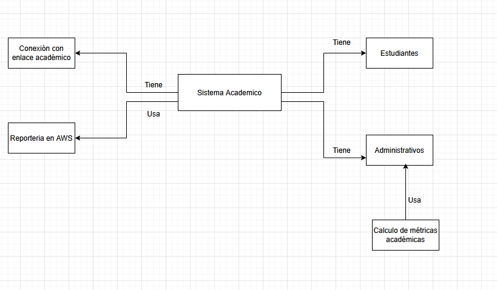

# Parcial Práctico - Primer Tercio (DOSW)

**Estudiante:** Isaac Burgos  
**Grupo:** 1
**Institución:** Escuela Colombiana de Ingeniería Julio Garavito  

---

## Prerrequisitos del Proyecto

### 1. Estructura de Carpetas
El proyecto sigue la estructura de Maven con la adición manual de la carpeta `docs` para la documentación técnica.

### 2. Evidencias de Acceso a Herramientas
A continuación, se presentan las capturas de pantalla que confirman el acceso a las herramientas de diseño y modelado requeridas:

## Tecnologías utilizadas
* **Lenguaje:** Java 21
* **Gestor de Dependencias:** Maven
* **Framework:** Spring Boot 

## Desarrollo parcial primer tercio

### Diagrama de contexto

### Segundo Punto. Indetificar dos patrones de diseño que se puedan aplicar al caso de estudio
Patrón 1: Composite

a. Nombre del patrón: Composite

b. Tipo: Estructural

c. Justificación:
El sistema maneja una estructura jerarquica y debe permitir registrar la estructura del curso
Patrón 2: Observer

a. Nombre del patrón: Observer

b. Tipo: De comportamiento

c. Justificación:
El sistema requiere que los promedios se actualicen automáticamente cuando se agregan o modifican evaluaciones.
El patrón Observer permite que cuando una evaluación cambie, el estudiante sea notificado y recalcule el promedio sin generar alto acoplamiento.

### Tercer punto .Identifique 5 requerimientos del sistema y clasifíquelos en funcionales (3) y no funcionales (2). Garantice que al menos un requerimiento funcional seleccionado utilice uno o los dos patrones identificados. (Añadirlo al README.md)**

**Requisistos No funcionales** La Interfaz debe ser responsive, La aplicacion web ultilice colores verde y blanco

**Requisitos funcionales** Calculo dinamico del promedio ponderado por estudiante,grupo,modulo y promedio general del bootcamp, el sistema debe poder obtener el listado de los estudiantes que estan en riesgo academico(Promedio Ponderado menor que 3.0) , el sistema debe poder registrar la estructura academica jerárquica del curso  

